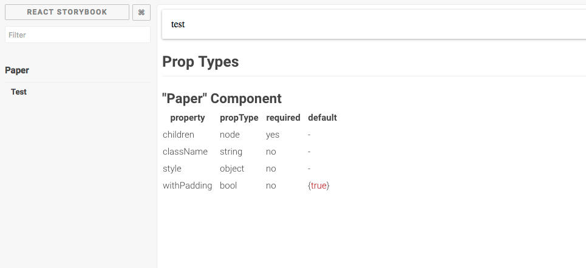

# Storybook-addon-props-fela

Document the props of your components in storybook.



### Why not [react-storybook-addon-info](https://github.com/storybooks/react-storybook-addon-info) ?

Quite simple, because he doesn't handle fela correctly and i use it on my project.

## Getting started

Install `storybook-addon-props-fela` :

```
yarn add storybook-addon-props-fela
// OR
npm i --save storybook-addon-props-fela
```

Then in your storybook import and add the addon :

```javascript
import { setAddon, storiesOf } from '@kadira/storybook';
import PropsAddon from 'storybook-addon-props-fela';

setAddon(PropsAddon);
```

Once you added the addon, a new method is available for your stories `addWithProps`.

`addWithProps` is the same as the default function of storybook `add` except the fact that it takes a third parameter. This third parameters is the component from which you want the props.

## Usage

To use the full power of this addon, your component need to provide `propTypes` and `defaultProps`.
The addon support flow and use it for the required property (it's quite a minimum support for now, i think we can do more with flow later).

```javascript
import React, { PropTypes } from 'react';
import { setAddon, storiesOf } from '@kadira/storybook';
import { createComponent } from 'react-fela';

import initFelaProvider from './initFela';
import PropsAddon from '../../lib/index';

const FelaProvider = initFelaProvider();

const test = ({ color }) => ({
  fontSize: 35,
  color,
});

const Test = createComponent(test, 'h1');
Test.defaultProps = { color: '#333' };
Test.propsTypes = {
  color: PropTypes.string,
};

setAddon(PropsAddon);

storiesOf('test', module)
  .addDecorator(FelaProvider)
  .addWithProps(
    'Paris',
    () => <Test fontSize={45} fontFamily="Roboto" align="center" color="#CAF200">Hello</Test>,
    Test,
  )
  .addWithProps('Orleans', () => <Test color="#236544">Hello</Test>, Test);

storiesOf('test 2', module).addWithProps('Paris', () => <div color="#333">test</div>);
```

If your component is enhanced with a decorator for example, you'll need to pass the rawComponent.

For example for a component like this:
```javascript

import React, {PropTypes} from 'react';
import {createComponent, connect} from 'react-fela';
import R from 'ramda';
import getContextThemeDecorator from 'layout/themes/getContextThemeDecorator.react';

import {Text} from 'components/baseComponents';
const badge = ({theme}: BadgeProps) => ({
    position: 'absolute',
    top: 0,
    right: 0,
    opacity: 0.85,
    color: 'white',
    padding: '3px 10px',
    borderRadius: '20%/50%',
    transform: 'translate(50%)',
    lineHeight: 1,
    overflow: 'hidden',
    whiteSpace: 'nowrap',
});

const container = ({small, tiny}: ContainerProps) => ({
    display: 'flex',
    position: 'relative',
    width: small ? 45 : tiny ? 25 : 70,
    height: small ? 45 : tiny ? 25 : 70,
});

const Badge = createComponent(badge, Text);
const Container = createComponent(container, 'div');
export const Avatar = ({badge, border, small, tiny, theme, ...props}) => (
    <Container {...props}>
        <DefaultAvatar {...{border, small, tiny}} />
        {badge ? <Badge {...{theme}}>{badge}</Badge> : null}
    </Container>
);

Avatar.defaultProps = {
    border: true,
};
Avatar.propTypes = {
    avatar: PropTypes.string,
    badge: PropTypes.string,
    border: PropTypes.bool,
    small: PropTypes.bool,
    tiny: PropTypes.bool,
    vamosTheme: PropTypes.string,
};

const enhance = R.pipe(getContextThemeDecorator);
export default enhance(Avatar);
```

you write your story like this :

```javascript
import React from 'react';
import {storiesOf} from '@kadira/storybook';
import Avatar, {Avatar as RawAvatar} from 'components/material/avatar.react';

export default FelaProvider =>
    storiesOf('Avatar', module)
        .addDecorator(FelaProvider)
        .addWithProps('without picture', () => <Avatar />, RawAvatar)
        .addWithProps('without picture small', () => <Avatar small />, RawAvatar)
        .addWithProps('without picture tiny', () => <Avatar tiny />, RawAvatar)
        .addWithProps(
            'with picture',
            () => <Avatar avatar="http://placehold.it/150x150" />,
            RawAvatar,
        )
        [...]
        .addWithProps('with badge', () => <Avatar badge="0 pts" />, RawAvatar);

```

## API

### addWithProps(kind, story, rawComponent)

Show the story with the props.